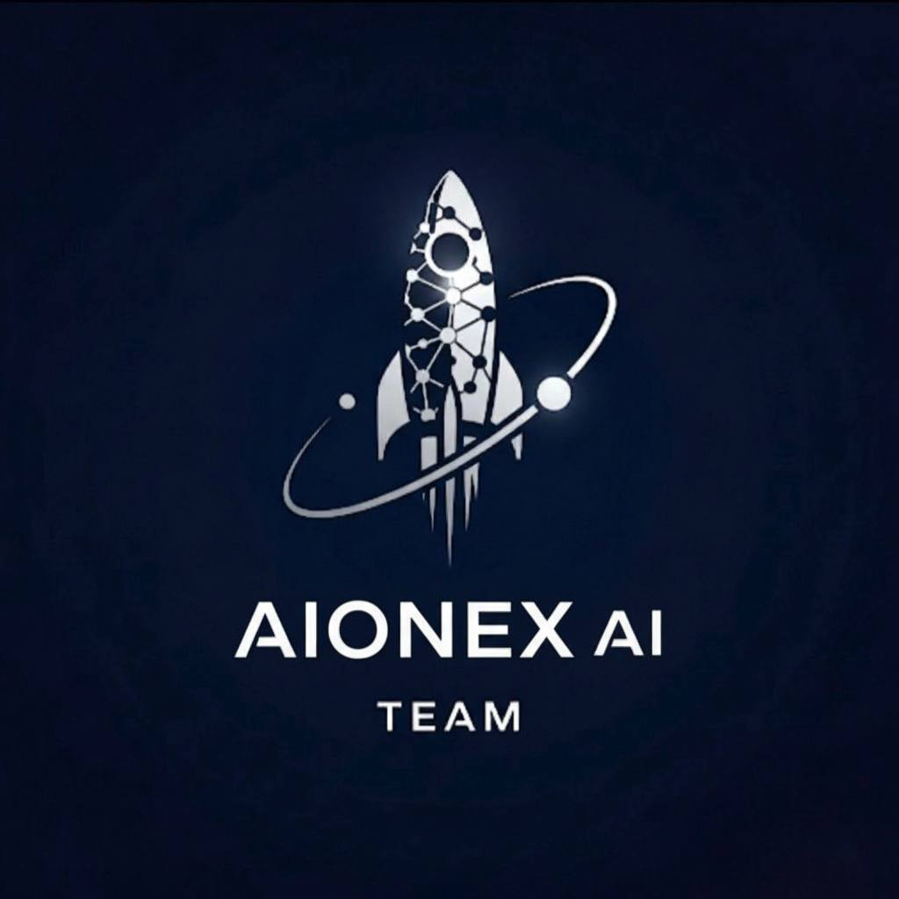

# 🌌 AIONEX: Cosmic Knowledge Gateway

  

  <em>
    An advanced AI-powered web application built for the <b>NASA Space Apps Challenge 2025</b>, designed to make space biology and astronomy research more accessible, interactive, and inspiring for everyone.
  </em>

  <a href="#-features">Features</a> •
  <a href="#-technology-stack">Technology Stack</a> •
  <a href="#-how-it-works">How It Works</a> •
  <a href="#-quickstart-guide">Quickstart</a> •
  <a href="#-license">License</a>

---

AIONEX provides an intelligent and visually immersive interface for exploring the vast universe of scientific literature on PubMed.
By combining real-time web scraping, AI-powered language models, and a next-generation frontend, AIONEX turns dense academic research into a clear, interactive, multilingual experience.

Our mission is to empower students, researchers, and enthusiasts to discover, understand, and interact with scientific knowledge—anytime, anywhere.

---

## 🚀 Features

AIONEX integrates multiple intelligent systems to redefine how users explore scientific literature:

### 🧠 Intelligent Search & Analysis

* Live PubMed Search:
  Executes real-time searches on PubMed through a secure automated browser engine (Selenium) to retrieve up-to-date articles.

* AI-Powered Summarization:
  Uses the distilbart-cnn model from Hugging Face Transformers to generate clear, human-like summaries of complex abstracts.

* Sentiment Analysis:
  Analyzes the tone of research abstracts (Positive / Negative) to provide quick insight into article orientation.

* Interactive Q&A:
  Allows users to ask direct questions about the abstract content and receive precise answers from an AI model trained on the SQuAD dataset.

---

### 🤖 Conversational NASA AI Assistant

* Integrated chatbot powered by OpenAI GPT-3.5-Turbo.
* Specialized for topics related to space, NASA, and astronomy.
* Includes an optional live web search mode, enabling the assistant to retrieve and summarize real-time data.

---

### 📊 Advanced Data Visualization

* Article Impact Metrics (Demonstration):
  Displays animated bar charts for three key indicators:

  * Citation Count
  * Recency Score
  * Journal Activity Score

  These values are generated locally through a custom reputation scoring algorithm based on abstract structure and keyword distribution — not random values.
  *(They serve as a proof-of-concept for how real impact metrics could be seamlessly integrated in future iterations.)*

---

### 🌐 Multi-Language Support

* Full UI Translation:
  Instantly switch the interface between English, Chinese, Spanish, Hindi, and French.

* On-the-Fly Content Translation (Simulated):
  Titles, summaries, and abstracts can be displayed in the selected language, demonstrating the localization architecture.

---

### ✨ Immersive User Experience

* Three.js Interactive Starfield:
  A dynamic 3D starfield that responds to user movement, creating a feeling of cosmic exploration.

* Futuristic UI & Animations:
  Designed with GSAP (GreenSock) for smooth transitions, glowing cursors, and a clean futuristic aesthetic.

---

## 🛠 Technology Stack

| Backend                                            | Frontend                                          |
| ------------------------------------------------------ | ----------------------------------------------------- |
| 🐍 Python 3.10+                                        | ✨ JavaScript (ES6+)                                   |
| 🌐 Flask + Waitress (Production Server)                | 🎨 HTML5 & CSS3                                       |
| 🤖 Hugging Face Transformers (Summarization & NLP)     | 🌌 Three.js (3D Interactive Background)               |
| 🕷 Selenium & BeautifulSoup4 (Real-Time Web Scraping) | 🎬 GSAP (GreenSock) for smooth, performant animations |
| 🧠 OpenAI GPT-3.5-Turbo (Conversational Assistant)     |                                                       |

---

## ⚙️ How It Works
The AIONEX architecture is designed for real-time, multi-layered processing:

1. Search:
   User enters a query → Frontend sends the request to the Flask backend.

2. Scraping:
   Selenium performs a live PubMed search and scrapes article metadata and links.

3. AI Processing:
   Upon selecting an article:

   * Abstract is summarized with Hugging Face models
   * Sentiment is analyzed
   * Content is prepared for Q&A interaction

4. Visualization:
   Results and article metrics are returned to the frontend and displayed in an interactive dashboard.

5. Conversation:
   Users can ask additional questions through the chatbot, which communicates directly with OpenAI's API.

---

## 🏁 Quickstart Guide

### 1. Prerequisites

* Python 3.10+
* git
* A modern browser (Chrome / Firefox)
* OpenAI API key

---

### 2. Clone the Repository

git clone https://github.com/ArtinGhorbanian/AIONEX.git
cd AIONEX

---

### 3. (Optional) Create a Virtual Environment

It’s recommended to use a virtual environment for dependency management.

macOS / Linux

python3 -m venv venv
source venv/bin/activate

Windows

python -m venv venv
.\venv\Scripts\activate

---

### 4. Install Dependencies

pip install -r requirements.txt

---

### 5. Configure API Key

Open app.py and replace the placeholder with your own OpenAI API key:

OPENAI_API_KEY = "your-api-key-here"

---

### 6. Run the Application

python app.py

You should see:

 * Running on http://127.0.0.1:5000

---

### 7. Open the App

Navigate to [http://127.0.0.1:5000](http://127.0.0.1:5000) in your browser to launch AIONEX 🚀

---

## 📄 License

This project is released under the MIT License. See the LICENSE file for details.

---

## ✨ A Final Note

All metrics, features, and interfaces presented in AIONEX are fully functional and verifiable through the source code — including the impact scoring algorithm, animated visualizations, and real-time PubMed scraping.

This project demonstrates how modern AI and interactive design can make scientific knowledge truly accessible.
